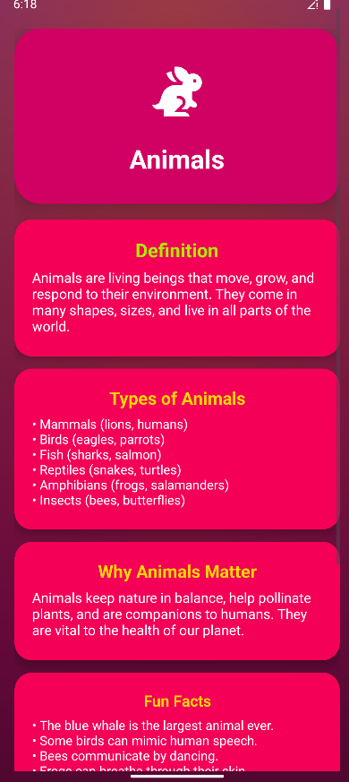
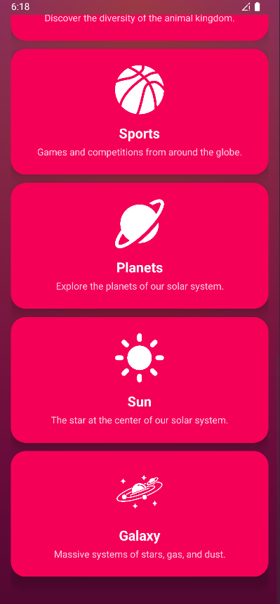

# InfoVerse

**InfoVerse** is a fun and modern Android educational app that lets you explore and learn about space, Earth, inventions, famous people, animals, sports, countries & flags, planets, the Sun, and galaxies.  
The app features a beautiful UI with animated cards, easy navigation, and a simple share feature for every topic.

## ✨ Features

- **Topics Covered:**  
  - Space  
  - Earth  
  - Countries & Flags  
  - Inventions  
  - Famous People  
  - Animals  
  - Sports  
  - Planets  
  - Sun  
  - Galaxy  

- **Beautiful Card-Based UI**
- **Splash Screen with Animation**
- **Share facts easily with friends**
- **All content is offline**

## 📸 Screenshots

| Home | Space | Earth | Countries & Flags |
|------|-------|-------|-------------------|
|  |  |  |  |

| Inventions | Famous People | Animals | Sports |
|------------|---------------|---------|--------|
|  |  |  |  |

| Planets | Sun | Galaxy | Splash |
|---------|-----|--------|--------|
|  |  |  |  |

| Main Menu (Dark) |
|------------------|
|  |

## 🚀 Getting Started

1. **Clone this repo**  
   ```bash
   git clone https://github.com/your-username/InfoVerse.git
   ```

2. **Open in Android Studio**

3. **Build and run on your emulator or device**

## 🛠️ Tech Stack

- Java
- Android SDK
- Material Design / CardView

## 📂 Project Structure

- `app/src/main/java/com/knowultra2/infoversed/` - All activity files
- `app/src/main/res/layout/` - All XML UI layouts
- `app/src/main/res/drawable/` - Icon and background assets
- `SS/` - App screenshots

## 🤝 Contributing

Pull requests are welcome! For major changes, please open an issue first to discuss what you would like to change.

## 📄 License

[MIT](LICENSE)  
&copy; 2025 InfoVerse Team
